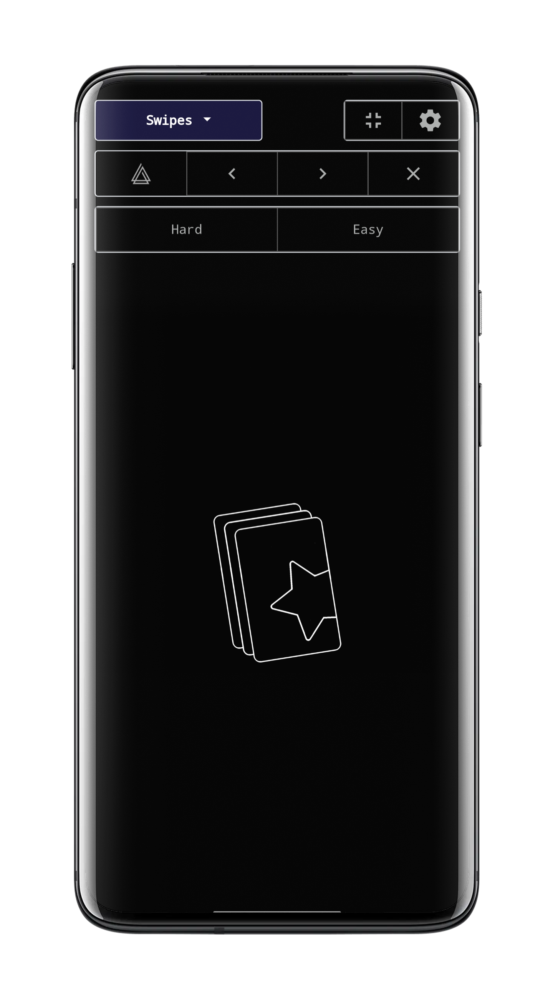
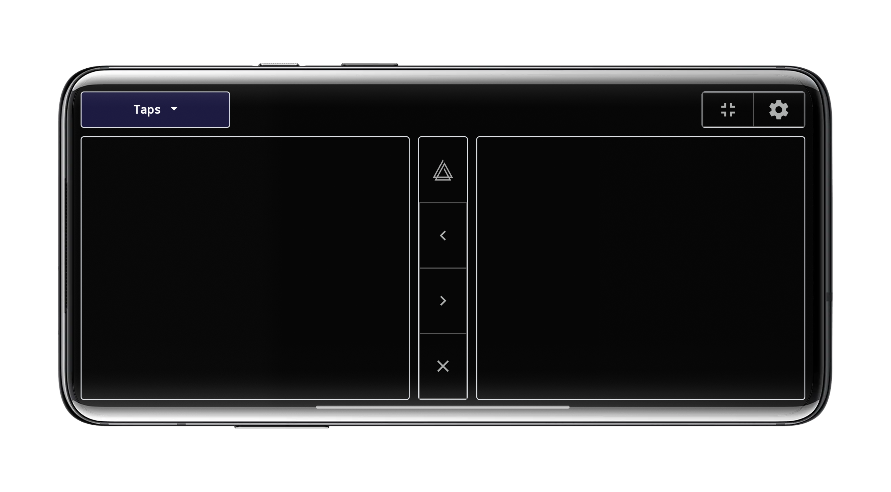

# Ankimote

**Ankimote** is an addon that adds remote control functionality to [Anki](https://apps.ankiweb.net/), the open source flashcards app.

After installing this addon, selecting 'Ankimote' from the Anki toolbar will start Ankimote and display a QR code and URL directing to the remote that can be accessed by any other device on the local network (usually your phone).

## Features

* Answer cards (again, hard, good, easy) from the remote and get visual feedback on the desktop app

* Scroll up, scroll down, undo from the remote

* One-hand (Swipes) and two-hand (Taps) control interfaces

* Switch decks without touching your computer

* Works with the AMBOSS addon to flip through popups

* 'Show Hints' action reveals hidden portions of cards in common decks such as Anking and Pepper

For developers:

* Custom JavaScript support for deeper interactions with cards

* Custom hook support for integration with other addons

## Screenshots

Connect by scanning a QR or visiting the URL from a phone or other device that is on the same local network.

Visual feedback in the desktop Anki app.

Swipe mode and swipe settings

 

Tap mode (best in landscape)

